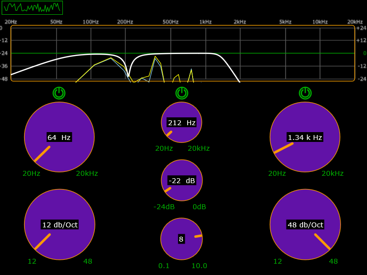

# SimpleEQ 🎛️

A professional-grade, 3-band parametric equalizer audio plugin (VST3 / AU / Standalone) built in C++ using the JUCE framework. 

This plugin features a fully custom user interface, real-time FFT spectrum analysis, and mathematically precise DSP filtering to give users complete control over their audio signal.

## ✨ Features

* **3-Band Parametric EQ:**
  * **Low Cut (High-Pass):** Adjustable frequency and slope (12, 24, 36, 48 dB/Oct).
  * **Peak Filter:** Adjustable frequency, gain (-24dB to +24dB), and Q factor.
  * **High Cut (Low-Pass):** Adjustable frequency and slope (12, 24, 36, 48 dB/Oct).
* **Real-Time Spectrum Analyzer:** A smooth, multi-threaded FFT (Fast Fourier Transform) analyzer that draws the audio path behind the frequency response curve.
* **Custom UI & Styling:** Bespoke rotary sliders, toggleable bypass switches for individual bands, and an interactive response curve.
* **Global Bypass:** Easily toggle the analyzer or individual filters to A/B test your audio.

## 📸 Interface Preview

## 🛠️ Technical Implementation

* **Language:** C++17
* **Framework:** JUCE
* **DSP:** Infinite Impulse Response (IIR) high-order Butterworth filters.
* **Architecture:** Lock-free, multi-threaded GUI and Audio thread communication using a custom FIFO (First-In-First-Out) queue to prevent audio dropouts during heavy visual rendering.

## 🙏 Credits & Acknowledgments

This project was built by following the excellent [JUCE C++ Audio Framework Tutorial](https://www.youtube.com/watch?v=i_Iq4_Kd7Rc) provided by freeCodeCamp.org and Matkat Music. 

While I wrote, debugged, and compiled the code myself as a hands-on way to learn digital signal processing and C++ plugin development, the core architecture, DSP routing, and UI logic belong to the original creator of the tutorial. This repository serves as a personal learning milestone and portfolio piece.

## 🚀 Installation (Using the Plugin)

If you just want to use the EQ in your DAW (like Reaper, Ableton, FL Studio, etc.):
1. Head over to the [Releases](../../releases) tab.
2. Download the `.zip` file for your operating system.
3. Extract the `.vst3` file and place it in your system's VST3 directory:
   * **Windows:** `C:\Program Files\Common Files\VST3`
   * **macOS:** `/Library/Audio/Plug-Ins/VST3`
4. Rescan your plugins in your DAW.

## 💻 Building from Source

If you want to compile the code yourself:

1. Clone the repository: `git clone https://github.com/championcode2025/AudioPlugin.git`
2. Open `simpleEQ.jucer` in the Projucer.
3. Export the project to your preferred IDE (Visual Studio / Xcode).
4. Build the project in **Release** mode.
